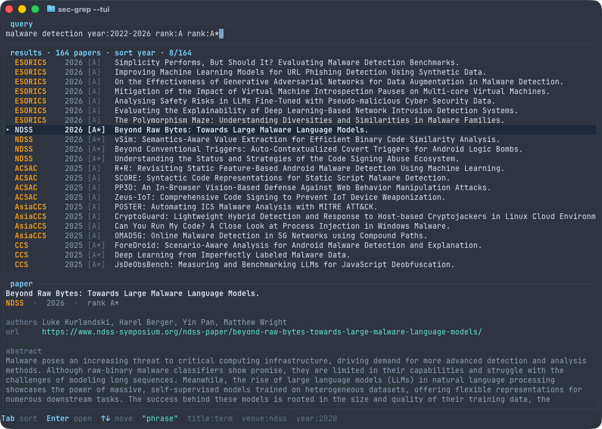

# sec-grep

Fast, local search across the security and privacy research literature.



`sec-grep` builds a local SQLite/FTS5 index from DBLP and gives you a clean CLI
and TUI for searching papers with an expressive query language across title,
authors, abstract, venue, year, rank, tag, and DOI.

## Why

- Search beyond the usual top-4 security venues with a configurable catalog.
- Keep the corpus local and query it quickly with SQLite/FTS5.
- Search in the CLI or TUI, and export CSV, JSON, or BibTeX for scripts.

## Install

Requires Rust 1.86 or newer.

```sh
cargo install --git https://github.com/philippnormann/sec-grep sec-grep
```

Or from a local checkout:

```sh
cargo install --path crates/sec-grep
```

Cargo installs to `~/.cargo/bin` on macOS/Linux and
`%USERPROFILE%\.cargo\bin` on Windows. Make sure that directory is on `PATH`.

## Use

```sh
sec-grep init
sec-grep update --since 2018
sec-grep --tui
```

In the TUI, use `Tab` to cycle sort modes, arrow keys to move, and `Enter` to
open the selected paper URL.

Sort CLI results with `--sort relevance`, `--sort year`, `--sort venue`, or
`--sort rank`.

Search from the shell:

```sh
sec-grep 'title:fuzzing venue:ndss year:2020-'
sec-grep '"side channel" OR cache' --venue CCS,SP
sec-grep 'doi:10.1145' --fields venue,year,title,doi
```

More examples:

```sh
# Recent malware-detection papers in A/A* venues
sec-grep 'malware detection' --year 2022- --rank A --rank 'A*' --sort year

# Export matching papers as BibTeX
sec-grep 'kernel fuzz*' --venue USENIX-SEC --format bibtex > papers.bib

# Script-friendly CSV with selected columns
sec-grep 'abstract:"large language model"' --tag systems \
  --format csv \
  --fields venue,year,title,authors,url

# Limit output for quick triage
sec-grep 'ransomware OR botnet' --year 2020- --limit 20

# Search a custom database path
sec-grep --db ./papers.db 'symbolic execution' --venue ccs
```

## Query Language

- Boolean search: `AND`, `OR`, `NOT`, parentheses, and quoted phrases.
- Text fields: `title:`, `author:`, `abstract:`.
- Metadata filters: `venue:`, `year:`, `rank:`, `tag:`, `doi:`.
- Prefix search: `fuzz*`.

Year filters accept `2020`, `2018-2024`, `2020-`, and `-2019`.

Metadata filters can be written inline:

```sh
sec-grep 'malware detection year:2022- rank:A'
```

or as CLI flags:

```sh
sec-grep 'malware detection' --year 2022- --rank A
```

Boolean operators apply only to full-text terms. Metadata filters are ORed
within one field and ANDed across fields.

```sh
sec-grep 'malware OR botnet' --rank A --rank 'A*'
sec-grep 'malware OR botnet year:2018 year:2029'
sec-grep 'malware OR botnet' --rank A --tag systems
```

## Venues

The bundled venue catalog lives in `crates/sec-grep-core/venues.yaml`. It
defines each venue's display name, DBLP stream, aliases, rank, tags, and
abstract parser hint.

After `sec-grep init`, you can extend or override the catalog with a user
`venues.yaml`:

- macOS: `~/Library/Application Support/sec-grep/venues.yaml`
- Linux: `~/.config/sec-grep/venues.yaml`
- Windows: `%APPDATA%\sec-grep\venues.yaml`

You can also pass a specific file with `--config path/to/venues.yaml`.

User venues are merged by `id`: reuse an existing `id` to override a bundled
venue, or add a new `id` to extend the catalog.

```yaml
defaults:
  min_year: 2018

venues:
  - id: DIMVA
    name: Conference on Detection of Intrusions and Malware & Vulnerability Assessment
    dblp_stream: conf/dimva
    aliases: [dimva]
    rank: B
    tags: [systems, network, malware]
    abstract_source: springer
```

Then ingest and search it:

```sh
sec-grep update --venue DIMVA
sec-grep 'malware' --venue DIMVA
```

`dblp_stream` is the DBLP stream slug from URLs like
`https://dblp.org/streams/conf/dimva`. `abstract_source` is optional; supported
values are `acm`, `ieee`, `ndss`, `springer`, and `usenix`.

## Abstracts

Abstract enrichment is optional, cached, and best-effort. sec-grep first tries
DOI-based APIs, then falls back to static publisher-page parsers.

```sh
sec-grep update --abstracts
sec-grep enrich --jobs 8
```

No API keys are required, but keys can improve rate limits and coverage.

| Variable | Used for | Get a key |
|---|---|---|
| `OPENALEX_API_KEY` | OpenAlex DOI lookup | [openalex.org/settings/api](https://openalex.org/settings/api) |
| `SEMANTIC_SCHOLAR_S2_KEY` | Semantic Scholar DOI lookup | [semanticscholar.org/product/api](https://www.semanticscholar.org/product/api) |

Set them in the shell:

```sh
export OPENALEX_API_KEY=...
export SEMANTIC_SCHOLAR_S2_KEY=...
```

Or place them in a local `.env` file:

```sh
OPENALEX_API_KEY=
SEMANTIC_SCHOLAR_S2_KEY=
```

`.env` is loaded automatically when present.

## Acknowledgements

Inspired by [top4grep](https://github.com/Kyle-Kyle/top4grep).

## License

Released under the [MIT License](LICENSE).
